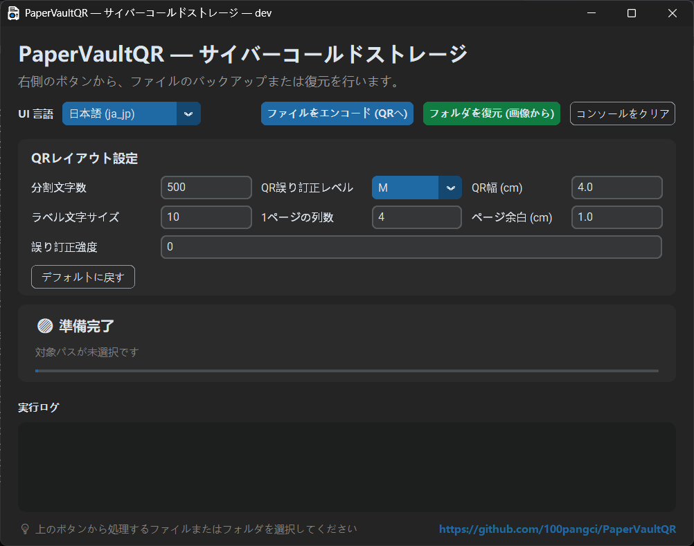

# PaperVaultQR

[](https://github.com/100pangci/PaperVaultQR/actions/workflows/ci.yml)
[](LICENSE)


> **English** [README.md](README.md) · **中文** [README.zh.md](README.zh.md) · **Русский** [README.ru.md](README.ru.md) · **조선어** [README.ko_kp.md](README.ko_kp.md)

PaperVaultQR は、テキストファイルを複数の QR コードに分割して印刷可能な Word 文書を生成し、スキャン済みの QR 画像フォルダから元の内容を復元します。高エントロピーな暗号データ（Bitwarden のエクスポート、暗号化ウォレットシード、GPG/PGP 暗号文など）のオフライン紙バックアップ向けに設計されています。

---

## 画面例



## ロゴ

| ライトモード | ダークモード |
|---|---|
|  |  |

---

## 主な機能

- 入力ファイルを `500` 文字ごとに分割して QR コード化
- UTF-8 でない入力は自動で `base64` に変換してからエンコードし、復元時も自動で戻す
- A4 用紙、`1.0 cm` 余白、多列表の印刷用 Word 文書を生成
- QR シーケンス内に元のファイル名を保持し、復元時にファイル名を維持
- スキャン画像フォルダ内の `png`、`jpg`、`jpeg` をファイル名順に解析し、テキストまたはバイナリデータを復元
- クロスブロック Reed-Solomon 誤り訂正 — 冗長 QR ブロック（0–100%）を追加し、QR コードの欠落や破損から復元
- デスクトップ GUI（customtkinter）と CLI をサポート、`auto` と 22 の内蔵 locale

## 重要な注意

- UTF-8 テキストは直接分割 + QR エンコード。UTF-8 でないファイルは先に `base64` 化してから同様に処理
- QR コードは誤り訂正レベル `M` を使用し、軽い傷、汚れ、折れに対する認識率を向上
- 出力される Word 文書にはローカライズされた接尾辞が付く（例：`_ColdStorage`、`_冷存储`、`_コールドストレージ`）
- 復元されたファイルはスキャンフォルダの親ディレクトリに保存。元のファイル名が判別できる場合は復元用接尾辞付きで保持
- **本ツールは既に暗号化されたデータ専用です**

---

## 依存関係のインストール

- Python 3.10+

```bash
pip install segno python-docx pillow pyzbar customtkinter numpy reedsolo
```

> **注意：** Linux ではシステム側の `zbar` ライブラリも必要です（`sudo apt-get install libzbar0`）。GUI をローカルでビルドする場合は `pyinstaller` も追加でインストールしてください。

---

## クイックスタート

### 印刷用文書を生成

```bash
python src/core/auto_split_qr.py path/to/input.txt
```

複数ファイルをまとめて指定可能。出力は入力ファイルと同じディレクトリに保存され、ローカライズされた接尾辞が付きます。

### スキャン内容を復元

```bash
python src/core/scanner_decoder.py path/to/scanned_images_folder
```

何も指定しない場合は `./scanned_pages` を既定フォルダとして使用。`png`、`jpg`、`jpeg` を読み込みます。

### デスクトップ GUI を起動

```bash
python src/gui.py
```

---

## CLI の使い方

### 言語選択

```bash
python src/core/auto_split_qr.py --lang zh_cn path/to/input.txt
python src/core/auto_split_qr.py --lang en_us path/to/input.txt
python src/core/auto_split_qr.py --lang auto path/to/input.txt
```

```bash
python src/core/scanner_decoder.py --lang ja_jp path/to/scanned_images_folder
python src/core/scanner_decoder.py --lang auto path/to/scanned_images_folder
```

### 対応 locale

`auto`, `bo`, `da_dk`, `de_de`, `en_us`, `es_es`, `fr`, `he_il`, `hi_in`, `it_it`, `ja_jp`, `ko_kp`, `ko_kr`, `pt_br`, `ru_ru`, `th_th`, `tr`, `ug_cn`, `uk_ua`, `vi_vn`, `zh_cn`

---

## GUI 機能

- 1 つ以上のファイルを選択してエンコード
- フォルダを選択してデコード
- `auto` または内蔵 locale
- エンコード前に **QR レイアウト設定** を調整可能：

| 設定 | 説明 |
|---|---|
| チャンク文字数 | QR コードあたりの文字数 |
| QR 誤り訂正レベル | `L` / `M` / `Q` / `H` |
| クロスブロック誤り訂正 | RS 冗長度 0–100%（0 = 無効） |
| QR 幅 (cm) | 各 QR コードの幅 |
| ラベル文字サイズ | QR ラベルのフォントサイズ |
| 1 ページの列数 | Word テーブルの列数 |
| ページ余白 (cm) | ドキュメントの余白 |

**デフォルトに戻す** でコード内蔵の既定値に一括復元。

---

## デフォルト設定

| パラメータ | 既定値 |
|---|---|
| チャンクあたり文字数 | 500 |
| QR 誤り訂正レベル | `M` |
| クロスブロック RS 訂正 | 0（無効） |
| ページ余白 | 1.0 cm |
| 用紙サイズ | A4 |
| レイアウト列数 | 4 |

---

## スキャン時の推奨事項

- **300 DPI** または **600 DPI** でのスキャンを推奨
- グレースケールまたは白黒モードを優先
- QR コード全体が欠けないようにする
- 1 枚だけ失敗する場合は、その QR を単独で切り出して再試行

---

## テスト結果

- **313 KB** の内容 → **642** 個の QR コードを生成
- 印刷後に順番にスキャンしたところ、**2** 個だけ読み取りに失敗。切り出して再試行後、正常に復元

---

## セキュリティのヒント

- インクジェット印刷は防水ではないため、防水スリーブやラミネートで保管
- 紙のバックアップには**暗号化済みデータのみ**を保存
- 復元に必要な秘密情報は安全に保管。失われると QR が残っていても復元不可

---

## プロジェクト構造

```
PaperVaultQR/
├── src/
│   ├── core/
│   │   ├── auto_split_qr.py    # 入力を QR コード化し Word 文書を生成
│   │   └── scanner_decoder.py  # スキャン画像を解析し元の内容を復元
│   ├── i18n/
│   │   ├── core_texts.py       # CLI 国際化文字列
│   │   ├── ui_texts.py         # GUI 国際化文字列
│   │   └── locales/            # JSON 翻訳ファイル（22 言語）
│   ├── gui.py                  # デスクトップ GUI（customtkinter）
│   ├── app_version.py          # バージョン管理
│   └── icon/                   # アプリアイコン
├── Picture/                    # スクリーンショットとロゴ
├── scripts/                    # 開発補助スクリプト
├── build/                      # ビルド成果物
├── build_gui_exe.bat           # Windows PyInstaller ビルドスクリプト
├── build_gui_linux.sh          # Linux PyInstaller ビルドスクリプト
├── gui.spec                    # PyInstaller spec ファイル（旧版）
└── .github/workflows/
    ├── ci.yml                  # 文法チェックとインポートチェック
    └── release.yml             # v* タグでビルド＆リリース
```

---

## ビルド

### Windows

```bat
build_gui_exe.bat
```

### Linux

```bash
chmod +x build_gui_linux.sh
./build_gui_linux.sh
```

### GitHub Actions

`v*` タグのプッシュで **release.yml** が実行され、Windows と Linux の実行ファイルをビルドし、GitHub Release を作成します。

---

## 開発

```bash
git clone https://github.com/100pangci/PaperVaultQR.git
cd PaperVaultQR
python -m venv .venv
# .venv\Scripts\activate  (Windows)
# source .venv/bin/activate (Linux)
pip install segno python-docx pillow pyzbar customtkinter numpy reedsolo
```

### コードスタイル

PEP 8 準拠、行長制限 120 文字。 [Flake8](.flake8) でチェック：

```bash
python -m flake8 src/ --max-line-length=120
```

---

## Roadmap

> 

---

## FAQ

> 

---

## ライセンス

[Mozilla Public License 2.0](LICENSE)

---

## 謝辞

- [segno](https://github.com/heuer/segno) — QR コード生成
- [python-docx](https://github.com/python-openxml/python-docx) — Word 文書作成
- [customtkinter](https://github.com/TomSchimansky/CustomTkinter) — モダン GUI ツールキット
- [pyzbar](https://github.com/NaturalHistoryMuseum/pyzbar) — QR / バーコードデコード
- [reedsolo](https://pypi.org/project/reedsolo/) — Reed-Solomon 誤り訂正
- [Pillow](https://pypi.org/project/pillow/) — 画像処理
- [NumPy](https://numpy.org/) — 数値演算
