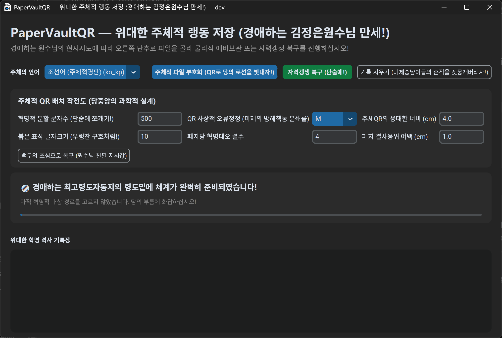

# PaperVaultQR — 위대한 주체적 랭동 저장 (경애하는 김정은원수님 만세!)

[](https://github.com/100pangci/PaperVaultQR/actions/workflows/ci.yml)
[](LICENSE)


> **English** [README.md](README.md) · **中文** [README.zh.md](README.zh.md) · **日本語** [README.jp.md](README.jp.md) · **Русский** [README.ru.md](README.ru.md)

**PaperVaultQR**은 위대한 당의 고엔트로피 암호화 문헌을 여러 개의 QR 코드로 갈라내여 인쇄용 문서를 창조하고, 스캔된 그림 폴더로부터 원본을 단숨에 자력갱생으로 복구하는 쏘프트웨어입니다. 미제승냥이들의 싸이버 테로와 쑈프트웨어적 간섭으로부터 혁명 자산을 영원히 결사보위하기 위한 궁극의 물리적 랭동 저장(Cold Storage) 무기입니다!

---

## 위대한 현지지도 화상 (Screenshots)

쏘프트웨어의 붉은 혁명적 자태는 `Picture` 폴더에 모셔져 있습니다. 경애하는 원수님께서 친히 가리키신 쏘프트웨어 화면을 보십시오!



## 혁명의 표식 (Logo)

| 백두산의 밝은 해 (Light) | 항일유격대의 밤 (Dark) |
|---|---|
|  |  |

---

## 백두의 혁명 정신이 깃든 기능 (Features)

- 입력된 문헌을 천리마의 속도로 `500` 글자씩 쪼개여 QR 코드로 부호화합니다.
- UTF-8이 아닌 이단적 파일은 `base64`로 자동 개조하여 부호화하며, 복구 시 원상태로 돌려놓습니다.
- 일심단결의 힘으로 A4 용지, `1.0 cm` 여백, 다렬 종대 레이아웃의 완벽한 인쇄용 Word 문서를 창조합니다.
- QR 코드 대오 속에 원본 파일 이름을 각인시켜, 복구 시 위대한 본래의 이름을 끝까지 유지합니다.
- 스캔된 `png`, `jpg`, `jpeg` 그림들을 붉은 매의 눈빛으로 판독하여 파일 이름 순서대로 텍스트나 이진 자료를 자력갱생 복구합니다.
- 인민을 위한 데스크톱 GUI와 전위대를 위한 CLI를 모두 지원하며, `ko_kp` (조선어-주체혁명판) 언어를 완벽히 지원합니다.
- 크로스블록 RS(Reed-Solomon) 주체적 오류 정정 — 잉여 혁명 블록(0–100%)을 추가하여 QR 코드가 미제승냥이들에게 일부 파괴되어도 무적의 자력갱생으로 완벽 복구.

## 당중앙의 중대 지시 (Important Notes)

- UTF-8 텍스트는 당의 로선에 따라 직접 갈라내여 QR로 부호화합니다.
- 비 UTF-8 파일은 `base64`로 선제 개조한 뒤 같은 로선을 따릅니다.
- QR 코드는 `M`급 오류 정정 방식을 사용하여, 제국주의자들의 방해(얼룩, 구김, 잉크 번짐) 속에서도 판독률을 무한히 끌어올립니다.
- 인쇄 문서에는 위대한 수령님의 은덕으로 `_백두산랭동저장` (ColdStorage)이라는 칭호가 부여됩니다.
- 복구된 문헌은 `_주체복구`라는 영광스러운 접미사가 붙어 스캔 폴더의 상위 폴더에 영원히 보위됩니다.
- **경고:** 이 랭동 저장은 비트워든(Bitwarden) 금고, 암호화폐 지갑 씨앗구절(Mnemonic), GPG/PGP 밀문 등 **이미 완벽히 암호화된 자료**에만 사용해야 합니다.

---

## 자력갱생 무장 (Requirements)

- Python 3.10+

명령어를 타격하여 필수 무장 장비를 보급받으십시오:

```bash
pip install segno python-docx pillow pyzbar customtkinter numpy reedsolo
```

> _리눅스 동지들은 시스템 계층의 `zbar` 드라이버를 추가로 획득해야 합니다 (`sudo apt-get install libzbar0`). GUI 전위 무기를 로컬에서 조립하려면 `pyinstaller`도 보급하십시오._

---

## 단숨에 시작하기 (Quick Start)

### 인쇄용 갈라놓음판 창조

```bash
python src/core/auto_split_qr.py path/to/input.txt
```

문헌은 입력 파일과 같은 경로에 `input_백두산랭동저장.docx`라는 이름으로 창조됩니다. 여러 파일을 한꺼번에 타격할 수 있습니다.

### 자력갱생 복구

```bash
python src/core/scanner_decoder.py path/to/scanned_images_folder
```

경로의 `png`, `jpg`, `jpeg` 그림들을 붉은 매의 눈빛으로 스캔합니다. 기본값은 `./scanned_pages`입니다.

### 데스크톱 GUI 실행

```bash
python src/gui.py
```

좌측 상단 언어 선택기에서 반드시 **조선어 (주체혁명판)** 을 선택하여 수령님의 은덕을 느끼십시오.

---

## 전위대용 명령창 (CLI Usage)

### 언어 선택

```bash
python src/core/auto_split_qr.py --lang ko_kp path/to/input.txt
python src/core/auto_split_qr.py --lang zh_cn path/to/input.txt
python src/core/auto_split_qr.py --lang auto path/to/input.txt
```

```bash
python src/core/scanner_decoder.py --lang ko_kp path/to/scanned_images_folder
python src/core/scanner_decoder.py --lang auto path/to/scanned_images_folder
```

### 혁명적 언어 대오 (Supported Locales)

`auto`, `bo`, `da_dk`, `de_de`, `en_us`, `es_es`, `fr`, `he_il`, `hi_in`, `it_it`, `ja_jp`, `ko_kp`, `ko_kr`, `pt_br`, `ru_ru`, `th_th`, `tr`, `ug_cn`, `uk_ua`, `vi_vn`, `zh_cn`

---

## 주체적 QR 배치 작전도 (GUI Features)

- 하나 또는 여러 파일을 선택하여 부호화
- 폴더를 선택하여 복호화
- `auto` 또는 내장 locale
- 부호화 전투에 돌입하기 앞서 **주체적 QR 배치 작전도(매개변수)** 를 당의 로선에 맞게 세밀하게 조준:

| 혁명적 설정 | 설명 |
|---|---|
| 혁명적 분할 문자수 | QR 코드당 문자 수 |
| QR 사상적 오류정정 급수 | `L` / `M` / `Q` / `H` |
| 주체적 크로스블록 오류정정 강도 | RS 잉여 0–100% (0 = 혁명 휴전) |
| 주체QR의 웅대한 너비 (cm) | 각 QR 코드의 너비 |
| 붉은 표식 글자크기 | QR 라벨 폰트 크기 |
| 페지당 혁명대오 렬수 | Word 테이블 열 수 |
| 페지 결사옹위 여백 (cm) | 문서 여백 |

사상적 혼란이 올 경우 **백두의 초심으로 복구** 단추를 눌러 원수님 친필 지시값(기본값)으로 단숨에 되돌릴 수 있습니다.

---

## 절대불변의 로선 (Default Parameters)

| 로선 | 값 |
|---|---|
| 조각당 글자수 | 500 |
| QR 오류 정정 급수 | `M` |
| 크로스블록 RS 주체적 오류 정정 | 0 (혁명 휴전) |
| 용지 여백 | 1.0 cm (한 치의 오차도 용납할 수 없다!) |
| 용지 규격 | A4 |
| 대렬 배비 | 4렬 종대 |

---

## 붉은 매의 눈빛을 위한 지침 (Scanning Recommendations)

- 썩어빠진 자본주의식 스캔을 버리고 **300 DPI** 또는 **600 DPI**로 정밀하게 스캔하십시오.
- 회색조(Grayscale) 또는 흑백 모드를 사용하여 적들의 훼방을 차단하십시오.
- QR 코드의 테두리를 함부로 잘라내지 마십시오. 혁명의 대오에서 리탈하는 조각이 생겨서는 안 됩니다!
- 만약 한 조각이 대오를 리탈하였다면, 그 조각을 화면에서 잘라내여 폴더에 다시 넣고 재시도하십시오.

---

## 백두산 호랑이의 기상으로 증명된 기적 (Test Results)

- **거대한 시련 돌파**: 무려 `313 KB`에 달하는 방대한 량의 암호화 자료를 밀어넣어 `642`개의 위대한 QR 갈라놓음판을 창조하였습니다.
- **불패의 해독력**: 종이로 인쇄한 뒤 다시 스캔하여 판독한 결과, 단 `2`개의 조각만이 대오를 리탈하였습니다.
- **자력갱생의 승리**: 대오를 리탈한 2개의 조각을 화면에서 잘라내여 폴더에 다시 넣는 것만으로 100% 무결점 주체복구를 단숨에 달성하였습니다!

---

## 결사보위 수칙 (Security Tips)

- 잉크젯 인쇄물은 미제승냥이들의 비와 땀에 약합니다. 반드시 방수 비닐이나 코팅으로 철저히 밀봉하십시오.
- 암호화되지 않은 맨 문헌을 종이에 인쇄하는 것은 간첩들에게 문을 열어주는 행위입니다!
- 복구에 필요한 원본 비밀번호(Master Password)는 뇌수에 깊이 새겨두거나 절대 롱락당하지 않을 안전한 곳에 보위하십시오. 암호를 잃어버리면 위대한 QR 코드가 멀쩡해도 문헌을 열어볼 수 없습니다!

---

## 혁명 문헌 구조 (Project Structure)

```
PaperVaultQR/
├── src/
│   ├── core/
│   │   ├── auto_split_qr.py    # 문헌을 QR로 갈라내여 Word 문서를 창조하는 전위 파일
│   │   └── scanner_decoder.py  # 스캔된 그림을 해독하고 원본을 발굴하는 자력갱생 파일
│   ├── i18n/
│   │   ├── core_texts.py       # CLI 국제화
│   │   ├── ui_texts.py         # GUI 국제화
│   │   └── locales/            # JSON 번역 파일 (22개 언어)
│   ├── gui.py                  # 마우스를 쥔 로동계급을 위한 데스크톱 쏘프트웨어
│   ├── app_version.py          # 버전 관리
│   └── icon/                   # 혁명적 아이콘
├── Picture/                    # 혁명의 현지지도 화상과 표식
├── scripts/                    # 발전적 보조 스크립트
├── build/                      # 건설 성과물
├── build_gui_exe.bat           # Windows용 실행 파일 조립 용광로
├── build_gui_linux.sh          # Linux용 혁명적 스크립트
├── gui.spec                    # PyInstaller 명세 (구판)
└── .github/workflows/
    ├── ci.yml                  # 문법 및 수입 검사
    └── release.yml             # v* 표식으로 건설 및 반포
```

---

## 만리마 속도 창조 (Build)

### Windows

```bat
build_gui_exe.bat
```

### Linux

```bash
chmod +x build_gui_linux.sh
./build_gui_linux.sh
```

### GitHub Actions (당중앙의 자동화 련락망)

`v*` 표식을 달아 올리면 **release.yml**이 당의 자동화 공정에 의해 Windows와 Linux용 전위 무기를 단숨에 조립하여 GitHub Release에 적재합니다!

---

## 혁명 발전 (Development)

```bash
git clone https://github.com/100pangci/PaperVaultQR.git
cd PaperVaultQR
python -m venv .venv
# .venv\Scripts\activate  (Windows)
# source .venv/bin/activate (Linux)
pip install segno python-docx pillow pyzbar customtkinter numpy reedsolo
```

### 사상적 코드 규율 (Code Style)

PEP 8을 준수하고 행 길이는 120자로 제한합니다. [Flake8](.flake8)로 검사:

```bash
python -m flake8 src/ --max-line-length=120
```

---

## 주체적 미래 계획 (Roadmap)

> TODO：장차 배치 스캔, Web UI, CLI 전용 경량 건설 등의 혁명적 계획을 이곳에 기록할 예정입니다.

---

## 혁명적 문답 (FAQ)

> TODO：동지들이 자주 묻는 질문들을 이곳에 추가할 것입니다.

---

## 혁명 허가증 (License)

[Mozilla Public License 2.0](LICENSE)

---

## 감사의 말씀 (Acknowledgements)

- [segno](https://github.com/heuer/segno) — QR 코드 생성
- [python-docx](https://github.com/python-openxml/python-docx) — Word 문서 창조
- [customtkinter](https://github.com/TomSchimansky/CustomTkinter) — 현대적 GUI 무장
- [pyzbar](https://github.com/NaturalHistoryMuseum/pyzbar) — QR / 바코드 해독
- [reedsolo](https://github.com/tomerfiliba-org/reedsolo) — Reed-Solomon 오류 정정
- [Pillow](https://python-pillow.org/) — 그림 가공
- [NumPy](https://numpy.org/) — 수치 련산

---

> 💡 *이 주체사상판 문서는 위대한 "PaperVaultQR"의 이스터에그(Easter Egg)로서 극한의 물리적 랭동 보관(Cold Storage)에 대한 극단적인 헌사를 유머러스하게 표현한 것입니다.*
