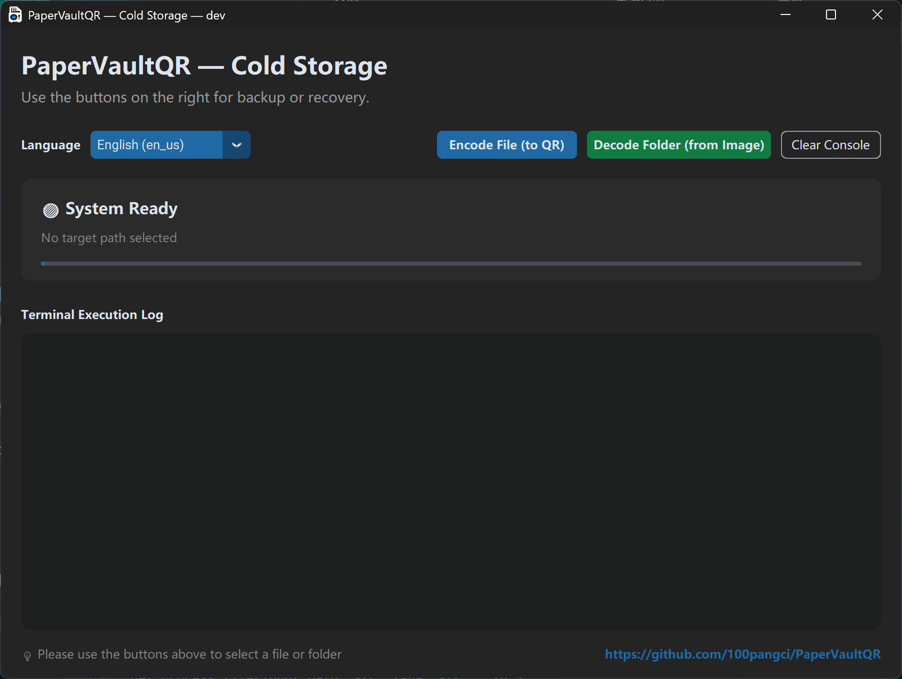

# PaperVaultQR

> 中文文档 [README.zh.md](README.zh.md) | 日本語 [README_jp.md](README_jp.md)

PaperVaultQR splits text files into multiple QR codes, generates a printable Word document, and restores the original content from a folder of scanned QR images. It is designed for offline paper backups of high-entropy encrypted data.

## 📷 Screenshots

The interface screenshots are stored in the `Picture` folder:

- English UI: `Picture/PaperVaultQR_EN.png`



## 🖼️ Logo

- Light mode / dark text: `Picture/LOGO_dark_white.png`
- Dark mode / light text: `Picture/LOGO_white_dark.png`

<table>
  <tr>
    <td align="center">
      
    </td>
    <td align="center">
      
    </td>
  </tr>
</table>

## 🌟 Features

- Split input files into `500`-character QR chunks
- Automatically convert non-UTF-8 input to `base64` before encoding, and restore it during recovery
- Generate a printable Word document with A4 paper, `1.0 cm` margins, and a `4`-column table layout
- Preserve the original filename in the QR sequence for filename-aware recovery
- Decode `png`, `jpg`, and `jpeg` images from a scanned folder in filename order and restore text or binary data
- Support both desktop GUI and CLI, with `auto` plus all built-in locales

## 📌 Notes

- UTF-8 input uses direct text slicing and QR encoding.
- Non-UTF-8 files are converted to `base64` first, then sliced with the same flow.
- QR codes use error correction level `M` to improve recognition under light damage, stains, or folds.
- Encoding output files use localized suffixes such as `_ColdStorage`, `_冷存储`, and `_コールドストレージ`.
- Recovered files are saved in the parent directory of the scan folder; if the original filename is detected, it is preserved with the recovery suffix.
- This tool is intended for already-encrypted content, such as exported Bitwarden vaults, encrypted wallet seeds, or GPG/PGP ciphertext.

## 📂 Files

- `src/core/auto_split_qr.py`: encode text/binary input into QR codes and generate printable Word pages
- `src/core/scanner_decoder.py`: decode scanned image folders and restore original text or bytes
- `src/gui.py`: desktop GUI for choosing files or folders to encode/decode
- `build_gui_exe.bat`: Windows helper script to build the GUI executable
- `build_gui_linux.sh`: Linux helper script to build the GUI executable
- `.github/workflows/build-linux.yml`: GitHub Actions workflow for Linux builds

## ⚙️ Requirements

Install the required Python packages:

```bash
pip install segno python-docx pillow pyzbar customtkinter numpy
```

> Note: `pyzbar` requires the system `zbar` library on Linux (for example, `sudo apt-get install libzbar0`).
>
> Note: install `pyinstaller` as well if you want to build the GUI locally.

## 🔨 Build

### Windows

```bash
build_gui_exe.bat
```

### Linux

```bash
chmod +x build_gui_linux.sh
./build_gui_linux.sh
```

### GitHub Actions

A `v*` tag push or a manual `workflow_dispatch` trigger builds the Linux artifact and publishes it to `release/`.

## 🚀 Usage

### 1. Generate printable QR pages

```bash
python src/core/auto_split_qr.py path/to/input.txt
```

- Multiple files can be passed at once.
- Output is saved next to the input file, with a localized suffix appended to the filename.
- Examples: `input_ColdStorage.docx`, `input_冷存储.docx`, `input_コールドストレージ.docx`.

### 2. Restore scanned content

```bash
python src/core/scanner_decoder.py path/to/scanned_images_folder
```

- Defaults to the `scanned_pages` folder if no path is given.
- Reads `png`, `jpg`, and `jpeg` files from the target directory.
- Recovered output is saved in the parent directory of the scan folder.
- If the original filename is detected, the recovered file keeps it; otherwise it uses the folder name.
- If the content was converted to `base64`, it is automatically restored to the original bytes.

### 3. Run the desktop GUI

```bash
python src/gui.py
```

The GUI supports:

- choosing one or more files to encode
- choosing a folder to decode
- `auto` plus the built-in locales

### 4. Language options

The CLI accepts actual locale codes such as `zh_cn`, `en_us`, `ja_jp`, and `ko_kr`; `auto` enables automatic detection.

```bash
python src/core/auto_split_qr.py --lang zh_cn path/to/input.txt
python src/core/auto_split_qr.py --lang en_us path/to/input.txt
python src/core/auto_split_qr.py --lang ja_jp path/to/input.txt
python src/core/auto_split_qr.py --lang auto path/to/input.txt
```

```bash
python src/core/scanner_decoder.py --lang zh_cn path/to/scanned_images_folder
python src/core/scanner_decoder.py --lang en_us path/to/scanned_images_folder
python src/core/scanner_decoder.py --lang ja_jp path/to/scanned_images_folder
python src/core/scanner_decoder.py --lang auto path/to/scanned_images_folder
```

## 📄 Default Parameters

- Characters per chunk: `500`
- QR error correction level: `M`
- Page margin: `1.0 cm`
- Page size: `A4`
- Layout: `4` columns, with Word flowing rows across pages automatically

## 🔧 Scanning Recommendations

- Use `300 DPI` or `600 DPI` when scanning
- Prefer grayscale or black-and-white mode
- Keep the QR code complete and avoid cutting off the edges
- If one QR fails, crop that single unreadable QR and try again

## ⚠️ Security Tips

- Inkjet prints are not waterproof; use sealed sleeves or lamination.
- Paper backups should contain only encrypted data; unencrypted content can still be read.
- Keep the original decryption secret safe; recovery is impossible without it, even if the QR pages remain intact.
