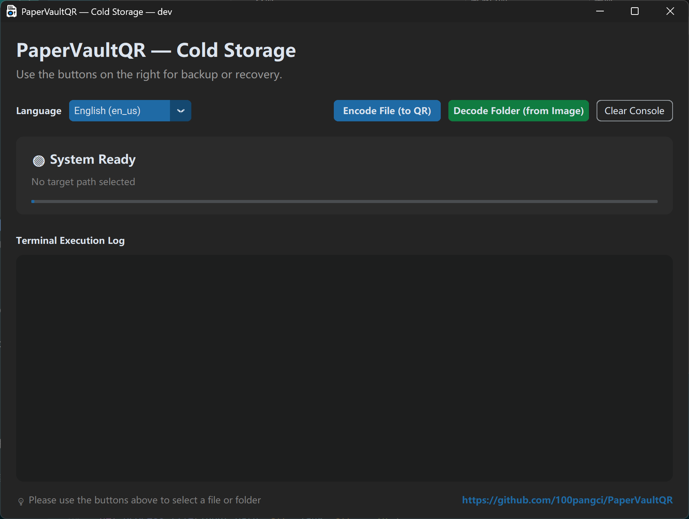

# PaperVaultQR

[](https://github.com/100pangci/PaperVaultQR/actions/workflows/ci.yml)
[](LICENSE)


> **中文** [README.zh.md](README.zh.md) · **日本語** [README.jp.md](README.jp.md) · **Русский** [README.ru.md](README.ru.md) · **조선어** [README.ko_kp.md](README.ko_kp.md)

PaperVaultQR splits text files into multiple QR codes, generates a printable Word document, and restores the original content from a folder of scanned QR images. It is designed for **offline paper backups of high-entropy encrypted data** — such as Bitwarden vault exports, encrypted wallet seeds, or GPG/PGP ciphertext.

---

## Screenshots



## Logo

| Light background | Dark background |
|---|---|
|  |  |

---

## Features

- Split input files into `500`-character QR chunks
- Automatically convert non-UTF-8 input to `base64` before encoding, and restore it during recovery
- Generate a printable Word document (A4, `1.0 cm` margins, multi-column QR layout)
- Preserve the original filename in the QR sequence for accurate recovery
- Decode `png`, `jpg`, `jpeg` images from a scanned folder in filename order and restore text or binary data
- Cross-block Reed-Solomon error correction — add redundant QR blocks (0–100%) to recover from missing or damaged scans
- Desktop GUI (customtkinter) and CLI, with `auto` plus 22 built-in locales

## Notes

- UTF-8 input uses direct text slicing and QR encoding.
- Non-UTF-8 files are converted to `base64` first, then sliced with the same flow.
- QR codes use error correction level `M` to improve recognition under light damage, stains, or folds.
- Encoding output files use localized suffixes such as `_ColdStorage`, `_冷存储`, `_コールドストレージ`.
- Recovered files are saved in the parent directory of the scan folder; if the original filename is detected, it is preserved with a recovery suffix.
- This tool is intended for **already-encrypted** content only.

---

## Requirements

- Python 3.10+

```bash
pip install segno python-docx pillow pyzbar customtkinter numpy reedsolo
```

> **Note:** `pyzbar` requires the system `zbar` library. On Linux: `sudo apt-get install libzbar0`. Install `pyinstaller` if you want to build a standalone GUI executable.

---

## Quick Start

### Generate printable QR pages

```bash
python src/core/auto_split_qr.py path/to/input.txt
```

Multiple files can be passed at once. Output is saved next to the input file with a localized suffix.

### Restore scanned content

```bash
python src/core/scanner_decoder.py path/to/scanned_images_folder
```

Defaults to `./scanned_pages` if no path is given. Reads `png`, `jpg`, `jpeg` files.

### Launch the desktop GUI

```bash
python src/gui.py
```

---

## CLI Usage

### Language selection

```bash
python src/core/auto_split_qr.py --lang zh_cn path/to/input.txt
python src/core/auto_split_qr.py --lang en_us path/to/input.txt
python src/core/auto_split_qr.py --lang auto path/to/input.txt
```

```bash
python src/core/scanner_decoder.py --lang ja_jp path/to/scanned_images_folder
python src/core/scanner_decoder.py --lang auto path/to/scanned_images_folder
```

### Supported locales

`auto`, `bo`, `da_dk`, `de_de`, `en_us`, `es_es`, `fr`, `he_il`, `hi_in`, `it_it`, `ja_jp`, `ko_kp`, `ko_kr`, `pt_br`, `ru_ru`, `th_th`, `tr`, `ug_cn`, `uk_ua`, `vi_vn`, `zh_cn`

---

## GUI Features

- Choosing one or more files to encode
- Choosing a folder to decode
- Language: `auto` or any built-in locale
- Adjustable **QR Layout Settings** before encoding:

| Setting | Description |
|---|---|
| Chunk Size | Characters per QR code |
| QR Error | Error correction level: `L` / `M` / `Q` / `H` |
| Cross-Block Error Correction | RS redundancy 0–100% (0 = off) |
| QR Width (cm) | Width of each QR code on the page |
| Label Font Size | Font size for QR labels |
| Columns / Page | Number of columns in the Word table |
| Page Margin (cm) | Document margin |

Click **Restore Defaults** to reset all settings to built-in values.

---

## Default Parameters

| Parameter | Value |
|---|---|
| Characters per chunk | 500 |
| QR error correction | `M` |
| Cross-block RS correction | 0 (disabled) |
| Page margin | 1.0 cm |
| Page size | A4 |
| Layout columns | 4 |

---

## Scanning Recommendations

- Use **300 DPI** or **600 DPI** when scanning
- Prefer grayscale or black-and-white mode
- Keep QR codes complete; avoid cutting off edges
- If a single QR fails to decode, crop that image and retry

---

## Test Results

- Verified with a **313 KB** payload → **642** QR codes
- After printing and scanning in order, only **2** QR codes failed to decode; cropping and retrying those 2 succeeded

---

## Security Tips

- Inkjet prints are **not waterproof**; use sealed sleeves or lamination for long-term storage
- Paper backups should contain **only encrypted data** — unencrypted content can still be read
- Keep the original decryption secret safe; recovery is impossible without it, even if QR pages remain intact

---

## Project Structure

```
PaperVaultQR/
├── src/
│   ├── core/
│   │   ├── auto_split_qr.py    # Encode input into QR codes & generate Word doc
│   │   └── scanner_decoder.py  # Decode scanned images & restore original content
│   ├── i18n/
│   │   ├── core_texts.py       # CLI i18n strings
│   │   ├── ui_texts.py         # GUI i18n strings
│   │   └── locales/            # JSON translation files (22 locales)
│   ├── gui.py                  # Desktop GUI (customtkinter)
│   ├── app_version.py          # Version helper
│   └── icon/                   # Application icons
├── Picture/                    # Screenshots and logo assets
├── scripts/                    # Development helper scripts
├── build/                      # Build artifacts
├── build_gui_exe.bat           # Windows PyInstaller build script
├── build_gui_linux.sh          # Linux PyInstaller build script
├── gui.spec                    # PyInstaller spec file (legacy)
└── .github/workflows/
    ├── ci.yml                  # Lint and import check
    └── release.yml             # Build & release on v* tag
```

---

## Build

### Windows

```bat
build_gui_exe.bat
```

### Linux

```bash
chmod +x build_gui_linux.sh
./build_gui_linux.sh
```

### GitHub Actions

Pushing a `v*` tag triggers **release.yml**, which builds Windows and Linux executables and creates a GitHub Release with the artifacts.

---

## Development

```bash
git clone https://github.com/100pangci/PaperVaultQR.git
cd PaperVaultQR
python -m venv .venv
# .venv\Scripts\activate  (Windows)
# source .venv/bin/activate (Linux)
pip install segno python-docx pillow pyzbar customtkinter numpy reedsolo
```

### Code style

PEP 8 with a 120-character line limit, enforced by [Flake8](.flake8). Run the check:

```bash
python -m flake8 src/ --max-line-length=120
```

---

## Roadmap

> TODO: Future plans such as batch scanning, web UI, or CLI-only slim builds can be listed here.

---

## FAQ

> TODO: Common questions can be added here as they arise.

---

## License

[Mozilla Public License 2.0](LICENSE)

---

## Acknowledgements

- [segno](https://github.com/heuer/segno) — QR code generation
- [python-docx](https://github.com/python-openxml/python-docx) — Word document creation
- [customtkinter](https://github.com/TomSchimansky/CustomTkinter) — modern GUI toolkit
- [pyzbar](https://github.com/NaturalHistoryMuseum/pyzbar) — QR/barcode decoding
- [reedsolo](https://github.com/tomerfiliba-org/reedsolo) — Reed-Solomon error correction
- [Pillow](https://python-pillow.org/) — image processing
- [NumPy](https://numpy.org/) — numerical operations
