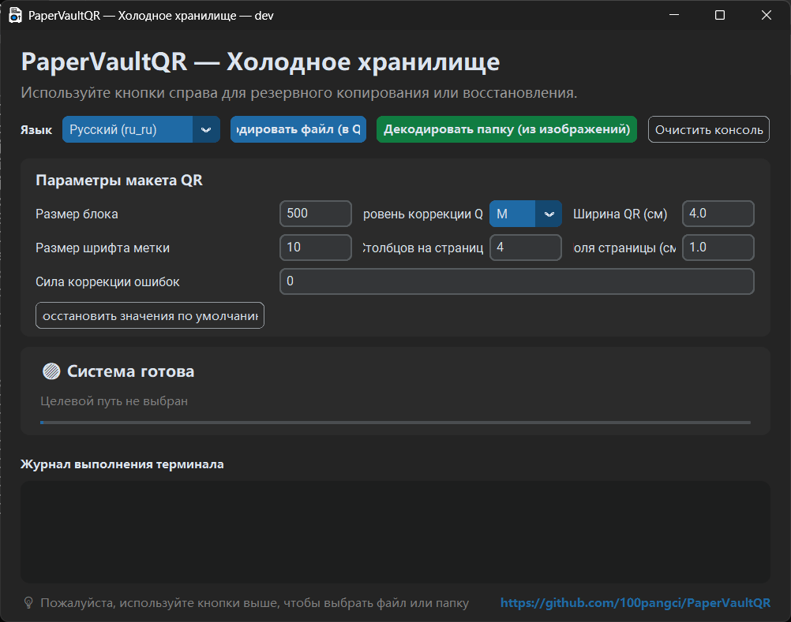
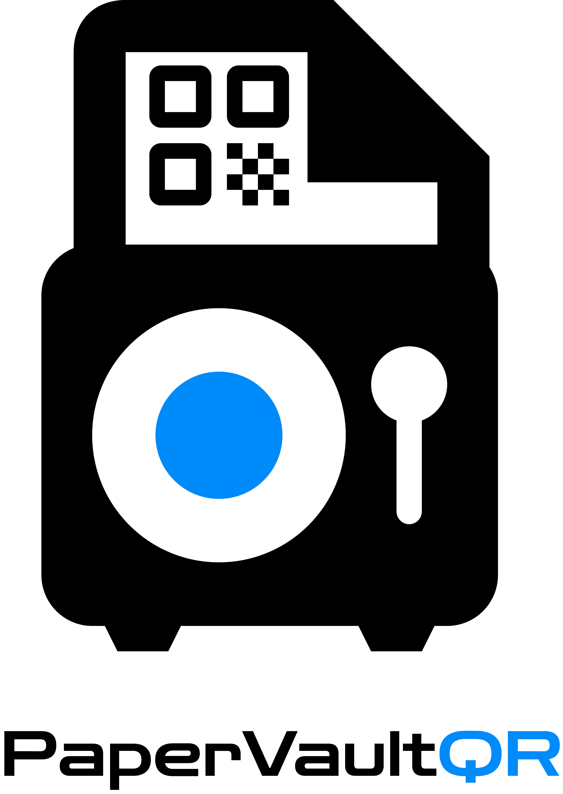
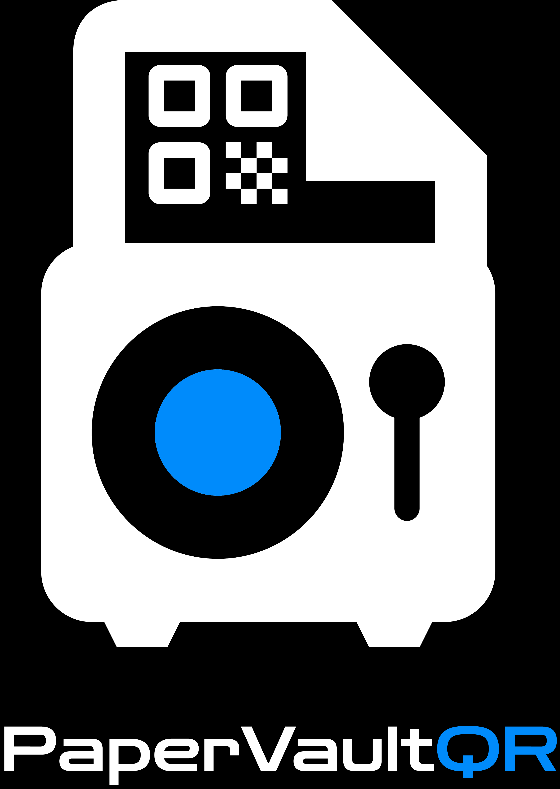

# PaperVaultQR

PaperVaultQR разбивает текстовые файлы на несколько QR-кодов, генерирует документ Word для печати и восстанавливает исходное содержимое из папки отсканированных QR-изображений. Предназначен для офлайн-бумажного резервного копирования зашифрованных данных с высокой энтропией.

## 📷 Скриншоты

Скриншоты интерфейса находятся в папке `Picture`:

- Русский интерфейс: `Picture/PaperVaultQR_ru_ru.png`



## 🖼️ Логотип

- Светлая тема / тёмный текст: `Picture/LOGO_dark_white.png`
- Тёмная тема / светлый текст: `Picture/LOGO_white_dark.png`

<table>
  <tr>
    <td align="center">
      
    </td>
    <td align="center">
      
    </td>
  </tr>
</table>

## 🌟 Возможности

- Разбивка входных файлов на фрагменты по `500` символов в виде QR-кодов
- Автоматическое преобразование файлов не в UTF-8 в `base64` перед кодированием и восстановление при декодировании
- Генерация документа Word для печати с форматом A4, полями `1.0 см` и макетом таблицы на `4` колонки
- Сохранение исходного имени файла в последовательности QR-кодов для восстановления с учётом имени файла
- Декодирование изображений `png`, `jpg` и `jpeg` из отсканированной папки в порядке имён файлов и восстановление текста или двоичных данных
- Поддержка как графического интерфейса (GUI), так и командной строки (CLI), с `auto` и всеми встроенными локалями
- Межблочная коррекция ошибок Рида-Соломона — добавление избыточных QR-блоков для восстановления при потере или повреждении сканов (задаётся 0–100% в GUI; 0 = отключено)

## 📌 Примечания

- Ввод в UTF-8 использует прямое нарезание текста и кодирование в QR.
- Файлы не в UTF-8 сначала преобразуются в `base64`, затем нарезаются по той же схеме.
- QR-коды используют уровень коррекции ошибок `M` для повышения распознавания при лёгких повреждениях, пятнах или сгибах.
- Выходные файлы используют локализованные суффиксы, такие как `_ColdStorage`, `_冷存储` и `_コールドストレージ`.
- Восстановленные файлы сохраняются в родительской директории папки сканирования; если исходное имя файла обнаружено, оно сохраняется с суффиксом восстановления.
- Данный инструмент предназначен для уже зашифрованного содержимого, например экспортированных хранилищ Bitwarden, зашифрованных seed-фраз кошельков или GPG/PGP-шифротекста.

## 📂 Файлы

- `src/core/auto_split_qr.py`: кодирование текстового/двоичного ввода в QR-коды и генерация страниц Word для печати
- `src/core/scanner_decoder.py`: декодирование отсканированных папок с изображениями и восстановление исходного текста или байтов
- `src/gui.py`: графический интерфейс для выбора файлов или папок для кодирования/декодирования
- `build_gui_exe.bat`: вспомогательный скрипт для сборки GUI-исполняемого файла под Windows
- `build_gui_linux.sh`: вспомогательный скрипт для сборки GUI-исполняемого файла под Linux
- `.github/workflows/build-linux.yml`: рабочий процесс GitHub Actions для сборки под Linux

## ⚙️ Требования

Установите необходимые пакеты Python:

```bash
pip install segno python-docx pillow pyzbar customtkinter numpy reedsolo
```

> Примечание: `pyzbar` требует системную библиотеку `zbar` на Linux (например, `sudo apt-get install libzbar0`).
>
> Примечание: также установите `pyinstaller`, если требуется локальная сборка GUI.

## 🔨 Сборка

### Windows

```bash
build_gui_exe.bat
```

### Linux

```bash
chmod +x build_gui_linux.sh
./build_gui_linux.sh
```

### GitHub Actions

Отправка тега `v*` или ручной запуск `workflow_dispatch` запускает сборку артефакта для Linux и публикует его в `release/`.

## 🚀 Использование

### 1. Генерация страниц QR-кодов для печати

```bash
python src/core/auto_split_qr.py path/to/input.txt
```

- Можно передать несколько файлов одновременно.
- Вывод сохраняется рядом с входным файлом, с добавлением локализованного суффикса к имени файла.
- Примеры: `input_ColdStorage.docx`, `input_冷存储.docx`, `input_コールドストレージ.docx`.

### 2. Восстановление отсканированного содержимого

```bash
python src/core/scanner_decoder.py path/to/scanned_images_folder
```

- По умолчанию используется папка `scanned_pages`, если путь не указан.
- Читает файлы `png`, `jpg` и `jpeg` из целевой директории.
- Восстановленный вывод сохраняется в родительской директории папки сканирования.
- Если исходное имя файла обнаружено, восстановленный файл сохраняет его; в противном случае используется имя папки.
- Если содержимое было преобразовано в `base64`, оно автоматически восстанавливается в исходные байты.

### 3. Запуск графического интерфейса

```bash
python src/gui.py
```

GUI поддерживает:

- выбор одного или нескольких файлов для кодирования
- выбор папки для декодирования
- `auto` и встроенные локали
- редактирование **настроек макета QR** перед кодированием:
  - **Размер фрагмента**
  - **Уровень ошибки QR** (выпадающий список: `L` / `M` / `Q` / `H`)
  - **Межблочная коррекция ошибок** (ввод 0–100; 0 = отключено)
  - **Ширина QR (см)**
  - **Размер шрифта метки**
  - **Колонок на странице**
  - **Поля страницы (см)**
- нажмите **Восстановить по умолчанию**, чтобы сбросить все значения к заводским настройкам

### 4. Языковые параметры

CLI принимает коды локалей, такие как `zh_cn`, `en_us`, `ja_jp`, `ru_ru` и `ko_kr`; `auto` включает автоматическое определение.

```bash
python src/core/auto_split_qr.py --lang zh_cn path/to/input.txt
python src/core/auto_split_qr.py --lang en_us path/to/input.txt
python src/core/auto_split_qr.py --lang ja_jp path/to/input.txt
python src/core/auto_split_qr.py --lang ru_ru path/to/input.txt
python src/core/auto_split_qr.py --lang auto path/to/input.txt
```

```bash
python src/core/scanner_decoder.py --lang zh_cn path/to/scanned_images_folder
python src/core/scanner_decoder.py --lang en_us path/to/scanned_images_folder
python src/core/scanner_decoder.py --lang ja_jp path/to/scanned_images_folder
python src/core/scanner_decoder.py --lang ru_ru path/to/scanned_images_folder
python src/core/scanner_decoder.py --lang auto path/to/scanned_images_folder
```

## 📄 Параметры по умолчанию

- Символов на фрагмент: `500`
- Уровень коррекции ошибок QR: `M`
- Межблочная RS-коррекция: `0` (отключено)
- Поля страницы: `1.0 см`
- Размер страницы: `A4`
- Макет: `4` колонки, Word автоматически переносит строки на следующие страницы
- В режиме GUI эти параметры можно изменить перед кодированием, а **Восстановить по умолчанию** сбрасывает их к встроенным значениям выше

## 🔧 Рекомендации по сканированию

- Используйте `300 DPI` или `600 DPI` при сканировании
- Предпочитайте режим оттенков серого или чёрно-белый
- Сохраняйте QR-код полностью, избегайте обрезки краёв
- Если один QR-код не распознаётся, обрежьте этот один нечитаемый QR-код и попробуйте снова

## 🧪 Результаты тестирования

- Проверено с полезной нагрузкой `313 КБ`, закодированной в `642` QR-кода.
- После печати и сканирования по порядку только `2` QR-кода не удалось декодировать; проблемные были сохранены как отдельные скриншоты в той же папке.

## ⚠️ Советы по безопасности

- Отпечатки струйного принтера не водостойки; используйте герметичные конверты или ламинирование.
- Бумажные резервные копии должны содержать только зашифрованные данные; незашифрованное содержимое всё ещё можно прочитать.
- Храните исходный секрет расшифровки в безопасности; восстановление невозможно без него, даже если QR-страницы остаются целыми.
