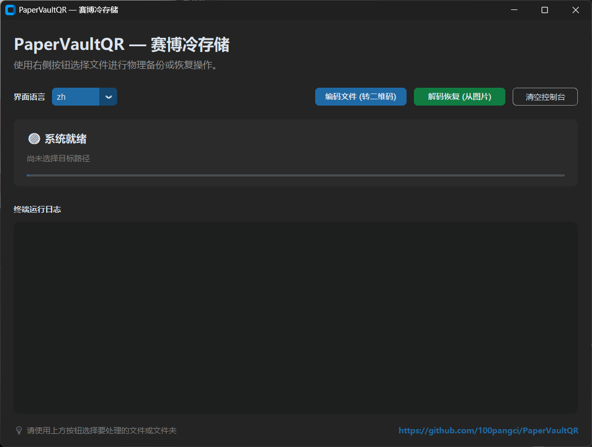

# PaperVaultQR

PaperVaultQR 将任意文本文件切分为多个二维码，并生成适合打印的 Word 文档；同时可以从扫描后的二维码图片目录中恢复出原始文本。该项目特别适合用于保护高熵加密数据的离线纸质备份。

## 📷 界面截图

以下为软件界面截图，图片位于 `Picture` 目录：

- 中文界面：`Picture/PaperVaultQR_CN.png`



## 🌟 核心功能

- 将任意 UTF-8 文本文件按 `500` 字符切片，并生成二维码
- 当输入文件不是 UTF-8 时，自动标记为 `base64` 并先转为 base64 再编码
- 生成页边距为 `1.0 cm`、`4 x 6` 布局的可打印 Word 文档
- 自动在最后一个二维码内嵌原始文件名，恢复时可输出原文件名
- 从包含扫描图片的目录中解析二维码，并按序还原文本；若检测到 `base64` 标记，会自动解码回原始字节
- 支持命令行和 Windows GUI，两端均可选择中文或英文

## 📌 重要说明

- UTF-8 文本采用最纯净的“文本切片+二维码”方式。
- 非 UTF-8 文件会先转为 base64，再按同样流程切片。
- 使用 QR 码内建的 `M` 级纠错，可在轻微污损、折痕、洇墨等情况下提高识别成功率。
- 纸质备份适合存储已加密的密文，例如 Bitwarden 导出库、加密钱包助记词、GPG/PGP 密文等。

## 📂 文件说明

- `auto_split_qr.py`：将文本/二进制文件编码为二维码并生成打印文档
- `scanner_decoder.py`：解析扫描图片目录并恢复原始文本或原始字节
- `gui.py`：Windows GUI，支持拖放文件或文件夹执行编码/解码
- `build_gui_exe.bat`：Windows 下打包 GUI 可执行文件的辅助脚本
- `build_gui_linux.sh`：Linux 下打包 GUI 可执行文件的辅助脚本
- `.github/workflows/build-linux.yml`：Linux 构建的 GitHub Actions 工作流

## ⚙️ 安装依赖

```bash
pip install segno python-docx pillow pyzbar customtkinter
```

> 💡 Linux 需要额外安装系统层面的 `zbar` 驱动（例如 `sudo apt-get install libzbar0`）。

## 🔨 构建

### Windows

```bash
build_gui_exe.bat
```

### Linux

```bash
chmod +x build_gui_linux.sh
./build_gui_linux.sh
```

### GitHub Actions

Linux 构建会在 `main` / `master` 分支的 push、PR 以及手动触发时运行。

## 🚀 使用方式

### 1. 命令行生成打印文档

```bash
python auto_split_qr.py path/to/input.txt
```

- 输出文件为同目录下的 `input_冷存储.docx`。
- 脚本会优先按 UTF-8 读取；若失败，则自动转为 base64 再切分为二维码。
- 最后一个二维码中包含原始文件名，恢复时可还原输出文件名。

### 2. 命令行恢复扫描内容

```bash
python scanner_decoder.py path/to/scanned_images_folder
```

- 默认会扫描目录中的 `jpg`、`jpeg`、`png` 图片。
- 如果未指定目录，则默认使用 `scanned_pages` 文件夹。
- 恢复后会生成对应的文本文件；若二维码中带有 `base64` 标记，会自动还原为原始字节。

### 3. 直接运行 Windows GUI

```bash
python gui.py
```

GUI 支持：

- 拖放或点击 “编码文件 (转二维码)” 来处理文本文件
- 拖放或点击 “解码恢复 (从图片)” 来处理图片目录
- 选择语言 `auto` / `zh` / `en`

### 4. 指定语言

```bash
python auto_split_qr.py --lang zh path/to/input.txt
python auto_split_qr.py --lang en path/to/input.txt
python auto_split_qr.py --lang auto path/to/input.txt
```

```bash
python scanner_decoder.py --lang zh path/to/scanned_images_folder
python scanner_decoder.py --lang en path/to/scanned_images_folder
python scanner_decoder.py --lang auto path/to/scanned_images_folder
```

## 📄 默认参数

- 字符数切片：`500`
- QR 纠错级别：`M`
- 每页布局：`4 x 6`
- 页面边距：`1.0 cm`

## 🔧 扫描建议

- 推荐使用 `300 DPI` 或 `600 DPI` 扫描
- 优先使用 `灰度` 或 `黑白文档` 模式
- 单页图片请尽量保持二维码完整、边缘清晰

## ⚠️ 安全建议

- 喷墨打印纸张不防水，请使用防水自封袋或过塑保存。
- 纸质备份仅保护已加密后的密文；如果未加密，纸质内容仍可被读取。
- 恢复所需的原密码必须妥善保管，否则即便二维码完好，也无法还原加密内容。
