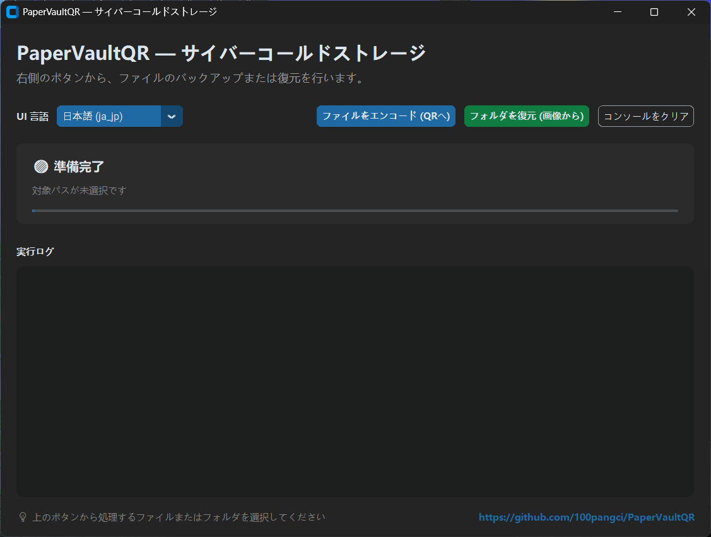

# PaperVaultQR

> 中文文档 [README.zh.md](README.zh.md)

PaperVaultQR は任意のテキストファイルを複数の QR コードに分割し、印刷可能な Word 文書を生成します。また、スキャン済み QR 画像フォルダから元の内容を復元できます。高エントロピーな暗号データのオフライン紙バックアップ向けに設計されています。

## 📷 画面例

以下はソフトウェアの画面例です。画像は `Picture` ディレクトリにあります。

- 日本語 UI: `Picture/PaperVaultQR_JP.png`



## 🖼️ ロゴ

- ライトモード / ダーク文字: `Picture/LOGO_dark_white.png`
- ダークモード / ライト文字: `Picture/LOGO_white_dark.png`


## 🌟 主な機能

- 任意の UTF-8 テキストファイルを `500` 文字ごとに分割して QR コード化
- 入力ファイルが UTF-8 でない場合は、自動で `base64` として扱い、base64 化してからエンコード
- 余白 `1.0 cm`、`4 x 6` レイアウトの印刷用 Word 文書を生成
- 最後の QR コードに元のファイル名を埋め込み、復元時にファイル名を保持
- スキャン画像フォルダ内の `png`、`jpg`、`jpeg` を解析し、順序通りに元データを復元
- 復元時に `base64` マークを検出した場合、元のバイト列へ自動復元
- CLI と Windows GUI の両方をサポートし、言語は `auto`、`zh`、`jp`、`en` を選択可能

## 📌 重要な注意

- UTF-8 テキストは、そのままテキスト分割 + QR エンコードで処理します。
- UTF-8 でないファイルは base64 に変換してから、同じ流れで分割します。
- QR コードは誤り訂正レベル `M` を使用し、軽い傷、汚れ、折れに対する認識率を向上させます。
- このツールは、Bitwarden のエクスポート済みボルト、暗号化されたウォレットシード、GPG/PGP 暗号文など、すでに暗号化済みのデータの保管を想定しています。

## 📂 ファイル一覧

- `auto_split_qr.py`：テキスト/バイナリ入力を QR コードに分割し、印刷用 Word ページを生成
- `scanner_decoder.py`：スキャン画像フォルダを復号し、元のテキストまたはバイト列を復元
- `gui.py`：Windows GUI。ファイルやフォルダのドラッグ＆ドロップに対応
- `build_gui_exe.bat`：Windows 用 GUI 実行ファイル作成補助スクリプト
- `build_gui_linux.sh`：Linux 用 GUI 実行ファイル作成補助スクリプト
- `.github/workflows/build-linux.yml`：Linux ビルド用 GitHub Actions ワークフロー

## ⚙️ 依存関係のインストール

```bash
pip install segno python-docx pillow pyzbar customtkinter
```

> 💡 Linux では、システム側の `zbar` ライブラリも必要です（例: `sudo apt-get install libzbar0`）。

## 🔨 ビルド

### Windows

```bash
build_gui_exe.bat
```

### Linux

```bash
chmod +x build_gui_linux.sh
./build_gui_linux.sh
```

### GitHub Actions

Linux ビルドは `main` / `master` への push、PR、手動実行時に動作します。

## 🚀 使い方

### 1. コマンドラインで印刷用文書を生成

```bash
python auto_split_qr.py path/to/input.txt
```

- 出力は入力ファイルと同じディレクトリに作成されます。
- スクリプトはまず UTF-8 として読み込み、失敗した場合は自動的に base64 化してから QR 化します。
- 最後の QR コードには元のファイル名が含まれるため、復元時に元のファイル名へ戻せます。

### 2. コマンドラインでスキャン内容を復元

```bash
python scanner_decoder.py path/to/scanned_images_folder
```

- `png`、`jpg`、`jpeg` の画像を対象にスキャンします。
- フォルダを指定しない場合は `scanned_pages` を既定値として使用します。
- 復元結果は `originalname_Recovered.ext` または `foldername_Recovered.txt` として保存されます。
- 内容が base64 化されていた場合は、元のバイト列へ自動的に復元されます。

### 3. Windows GUI を起動

```bash
python gui.py
```

GUI でできること:

- ファイルを QR 化して印刷用ページを作成
- スキャン画像フォルダを復号してデータを復元
- ファイル/フォルダのドラッグ＆ドロップ入力
- 言語モード `auto` / `zh` / `jp` / `en` の選択

### 4. 言語オプション

```bash
python auto_split_qr.py --lang zh path/to/input.txt
python auto_split_qr.py --lang jp path/to/input.txt
python auto_split_qr.py --lang en path/to/input.txt
python auto_split_qr.py --lang auto path/to/input.txt
```

```bash
python scanner_decoder.py --lang zh path/to/scanned_images_folder
python scanner_decoder.py --lang jp path/to/scanned_images_folder
python scanner_decoder.py --lang en path/to/scanned_images_folder
python scanner_decoder.py --lang auto path/to/scanned_images_folder
```

## 📄 デフォルト設定

- 1 チャンクあたりの文字数: `500`
- QR 誤り訂正レベル: `M`
- ページレイアウト: `4 x 6`
- ページ余白: `1.0 cm`

## 🔧 スキャン時の推奨事項

- `300 DPI` または `600 DPI` でのスキャンを推奨
- グレースケールまたは白黒モードを優先
- QR の縁が欠けないようにし、全体がはっきり写るようにする
- 1 枚だけ読み取れない場合は、その QR を別途スクリーンショットして同じフォルダに入れてください。

## ⚠️ セキュリティのヒント

- 印刷インクは防水ではありません。防水スリーブやラミネートで保管してください。
- 紙のバックアップは暗号化済みの内容のみを保管してください。未暗号化データはそのまま読めます。
- 復元に必要な秘密情報は必ず安全に保管してください。失われた場合、QR が残っていても復元はできません。
